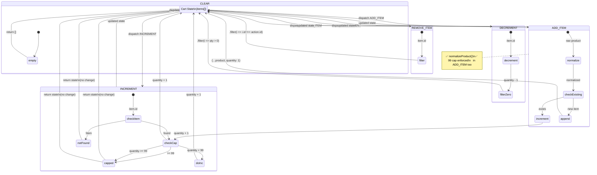
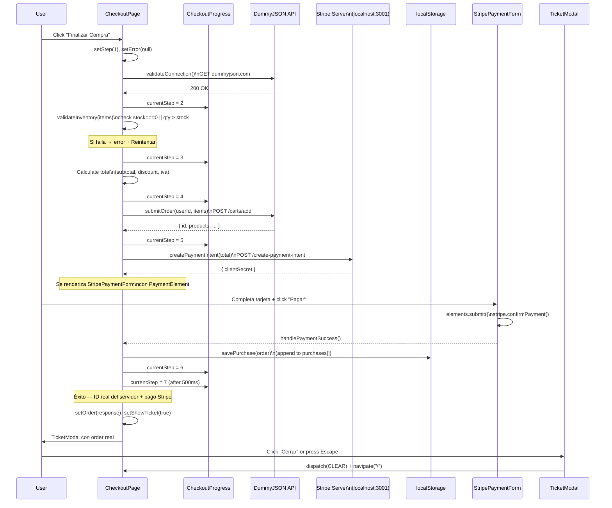

# Application Flows — DotaBURGUERS

> Referencia completa de los 12 flujos de aplicación existentes, pipelines de datos,
> máquinas de estado y secuencias de autenticación en la aplicación DotaBURGUERS.

**Última actualización**: 2026-07-02
**Stack**: React 19 + Vite 8 + Tailwind CSS v4 + React Router v7 + Stripe
**APIs**: FakeStore (productos), DummyJSON (usuarios y órdenes), Stripe (pagos)
**Persistencia**: localStorage (cart versionado + user + purchases)
**Archivos fuente**: 23 (1 api.js, 1 utils.js, 1 stripe.js, 3 contextos, 5 páginas, 9 componentes, 1 splash, 1 server)

---

## Tabla de Contenidos

- [Inventario de Flujos](#inventario-de-flujos)
- [Flow 1: Navegación / Routing](#flow-1-navegación--routing)
- [Flow 2: Autenticación (Login)](#flow-2-autenticación-login)
- [Flow 3: Gestión del Carrito (CRUD)](#flow-3-gestión-del-carrito-crud)
- [Flow 4: Checkout (APIs Reales)](#flow-4-checkout-apis-reales)
- [Flow 5: Filtrado y Búsqueda de Productos](#flow-5-filtrado-y-búsqueda-de-productos)
- [Flow 6: Agregar al Carrito (desde Product Card)](#flow-6-agregar-al-carrito-desde-product-card)
- [Flow 7: Cart Summary → Navegación a Checkout](#flow-7-cart-summary--navegación-a-checkout)
- [Flow 8: Menú de Usuario en Header](#flow-8-menú-de-usuario-en-header)
- [Flow 9: Ticket Modal Post-Checkout](#flow-9-ticket-modal-post-checkout)
- [Flow 10: Checkout Progress Stepper](#flow-10-checkout-progress-stepper)
- [Flow 11: Footer Navigation](#flow-11-footer-navigation)
- [Flow 12: Mis Compras (Historial)](#flow-12-mis-compras-historial)
- [Appendix A: Diagramas Mermaid](#appendix-a-diagramas-mermaid)
- [Appendix B: Pseudocódigo](#appendix-b-pseudocódigo)
- [Appendix C: Flujos Faltantes (12)](#appendix-c-flujos-faltantes-12)
- [Appendix D: Bug Log](#appendix-d-bug-log)

---

## Inventario de Flujos

| # | Flow | Archivo(s) Principal(es) | Tipo | Auth |
|---|------|--------------------------|------|------|
| 1 | Navegación / Routing | `src/App.jsx` | Infraestructura | No |
| 2 | Autenticación (Login) | `src/context/AuthContext.jsx`, `src/pages/LoginPage.jsx` | Async API | Sí |
| 3 | Gestión del Carrito (CRUD) | `src/context/CartContext.jsx`, `src/pages/CartPage.jsx`, `src/components/CartItem.jsx` | Reducer | No |
| 4 | Checkout (APIs Reales) | `src/pages/CheckoutPage.jsx`, `src/api.js` | Async Step Machine | Sí |
| 5 | Filtrado y Búsqueda de Productos | `src/pages/HomePage.jsx`, `src/api.js`, `src/utils.js` | Pipeline (useMemo) | No |
| 6 | Agregar al Carrito | `src/components/ProductCard.jsx` → `CartContext.jsx` | Dispatch | No |
| 7 | Cart Summary → Checkout | `src/components/CartSummary.jsx` | Auth Gate + Display | Dual |
| 8 | Menú de Usuario (Header) | `src/components/Header.jsx` | UI + Auth | Dual |
| 9 | Ticket Modal Post-Checkout | `src/components/TicketModal.jsx` | Modal + Receipt | Sí |
| 10 | Checkout Progress Stepper | `src/components/CheckoutProgress.jsx` | Display | Sí |
| 11 | Footer Navigation | `src/components/Footer.jsx` | Static UI | No |
| 12 | Mis Compras (Historial) | `src/pages/MyPurchasesPage.jsx`, `src/api.js` | Read localStorage | Sí |

---

## Flow 1: Navegación / Routing

**Archivo**: `src/App.jsx` (L9–L27)

**Propósito**: Define la estructura de providers y las rutas principales de la SPA, incluyendo guards a nivel componente.

**Trigger**: El usuario accede a cualquier URL de la aplicación.

**Puntos de salida**: Renderizado del componente de página correspondiente o redirect.

**Estructura de Providers**:

```
BrowserRouter
  └── AuthProvider         (src/context/AuthContext.jsx)
       └── CartProvider    (src/context/CartContext.jsx)
            └── Routes
```

**Rutas definidas** (App.jsx L15–L21):

| Ruta | Componente | Tipo | Auth Required |
|------|-----------|------|---------------|
| `/` | `HomePage` | Pública | No |
| `/carrito` | `CartPage` | Pública | No |
| `/login` | `LoginPage` | Pública | No |
| `/checkout` | `CheckoutPage` | Protegida por guard | Sí (con check de items) |
| `/mis-compras` | `MyPurchasesPage` | Protegida por guard | Sí |
| `*` | `Navigate to="/"` | Catch-all redirect | No |

**Decision Points**:

- La ruta `/checkout` NO tiene un guard a nivel de router — la protección se hace **dentro** del componente `CheckoutPage` mediante un `useEffect` (CheckoutPage.jsx):
  - Si `items.length === 0` → redirect a `/`
  - Si `!user` → redirect a `/login`
- Catch-all (`*`) redirige siempre a `/`, evitando páginas 404.

**Data Involved**:
- **Read**: `user` (AuthContext), `items` (CartContext) — solo en CheckoutPage

**Edge Cases**:
- Acceso directo a `/checkout` sin items → redirect a home
- Acceso directo a `/checkout` sin sesión → redirect a login
- Ruta inexistente → catch-all redirect a `/`

> **Diagrama asociado**: Ver [Fig. E: Navegación + Auth Gate](#fig-e-navegación--auth-gate)

---

## Flow 2: Autenticación (Login)

**Archivo**: `src/context/AuthContext.jsx`, `src/pages/LoginPage.jsx`

**Propósito**: Permitir que el usuario inicie sesión con su username contra la API de DummyJSON, persista la sesión en localStorage, y pueda cerrarla.

### 2.1 Restauración de Sesión (AuthContext.jsx)

Al montar `AuthProvider`:
1. Lee `localStorage.getItem("dotaburgers-user")`
2. Si existe y es JSON válido → `setUser(JSON.parse(raw))`
3. Si el JSON es inválido → `localStorage.removeItem(...)` (corrupción silenciosa)

### 2.2 Login (AuthContext.jsx + LoginPage.jsx)

**Trigger**: El usuario completa el formulario de login y hace submit.

**Pasos**:
1. `handleSubmit` captura el evento (LoginPage.jsx)
2. Validación: si `username.trim()` está vacío → **no-op**, sin feedback
3. `setLoading(true)`, `setError("")`
4. Llama a `searchUser(username)` desde `api.js`
5. `api.searchUser()` hace `fetch("https://dummyjson.com/users")` + parse
6. Busca coincidencia exacta: `users.find(u => u.username === username)`
7. Si hay error HTTP → `throw new Error("Error de conexión")`
8. Si no encuentra usuario → `throw new Error("Usuario no encontrado")`
9. Éxito: extrae `{ id, username, firstName, lastName, email, image }`
10. `setUser(userData)`, `localStorage.setItem(...)`
11. `navigate("/checkout")` (LoginPage.jsx)

**Puntos de salida**:
- Éxito: redirección a `/checkout`
- Error: mensaje de error en pantalla + animación shake (LoginPage.jsx)

**3 Caminos de Error**:
1. Username vacío → **sin feedback** (no-op silencioso)
2. Error de red / HTTP error → `"Error de conexión"`
3. Username no encontrado → `"Usuario no encontrado"`

**Animación Shake**: Animación CSS via Web Animations API que desplaza el input horizontalmente durante 400ms.

**Data Involved**:
- **Read**: `username` (estado local LoginPage)
- **Write**: `user` (AuthContext state), `localStorage` (`dotaburgers-user`)
- **API**: `GET https://dummyjson.com/users` (lista completa, búsqueda client-side)

**Edge Cases**:
- Usuario ya logueado que visita `/login` — NO hay redirect, muestra el form igual
- Doble submit durante `loading=true` — el botón se deshabilita (`disabled`)
- Corrupción de localStorage en el mount — se elimina la entrada corrupta
- Sesión expirada (no hay mecanismo — DummyJSON no tiene tokens expirables)

### 2.3 Logout (AuthContext.jsx)

**Trigger**: El usuario hace clic en "Cerrar sesión" en el menú del Header (Header.jsx).

**Pasos**:
1. `setUser(null)` — limpia estado React
2. `localStorage.removeItem("dotaburgers-user")` — limpia persistencia

**Sin llamada API** — el logout es puramente local.

> **Diagrama asociado**: Ver [Fig. A: Auth Login Flowchart](#fig-a-auth-login-flowchart)
> **Pseudocódigo asociado**: Ver [P1: Login Flow](#p1-login-flow)

---

## Flow 3: Gestión del Carrito (CRUD)

**Archivo**: `src/context/CartContext.jsx`, `src/pages/CartPage.jsx`, `src/components/CartItem.jsx`

**Propósito**: Implementar un carrito de compras completo con 5 operaciones (ADD, REMOVE, INCREMENT, DECREMENT, CLEAR) manejadas por un `useReducer` con persistencia versionada en localStorage.

### 3.1 Inicialización (CartContext.jsx)

- `CART_VERSION = 2` (constante)
- `loadCart()`: función initializer que lee `localStorage.getItem("dotaburgers-cart")`
- Espera formato `{ version: 2, items: [...] }`
- Si `version !== CART_VERSION` o hay error de parse → retorna `[]` (array vacío)
- `useReducer(cartReducer, [], loadCart)` — el tercer argumento es el initializer lazy

### 3.2 Las 5 Acciones del Reducer (CartContext.jsx)

#### ADD_ITEM
```
Normalizar producto via normalizeProduct() si viene de API raw (FakeStore)
Buscar item existente por product.id
├── Si existe → mapear y sumar +1 a quantity
├── Si quantity >= 99 → return state (hard cap)
└── Si no existe → agregar nuevo item con quantity: 1
✅ ADD_ITEM respeta el cap de 99 (fijo)
```

#### REMOVE_ITEM
```
RETURN state.filter(item => item.id !== action.id)
```

#### INCREMENT
```
Buscar item por action.id
├── Si no existe → return state (no-op)
├── Si quantity >= 99 → return state (hard cap)
└── Sino → mapear y sumar +1 a quantity
```

#### DECREMENT
```
Mapear todos los items restando 1 al que coincide
Filtrar items con quantity > 0
→ Si quantity llega a 0, el item se elimina automáticamente
```

#### CLEAR
```
RETURN []  — carrito vacío
```

### 3.3 Persistencia Versionada (CartContext.jsx)

```js
useEffect(() => {
  localStorage.setItem("dotaburgers-cart", JSON.stringify({
    version: CART_VERSION,
    items
  }));
}, [items]);
```

Cada cambio en `items` persiste el objeto `{ version, items }` en localStorage. El versionado permite migrar o limpiar datos stale silenciosamente si el schema del carrito cambia en el futuro.

### 3.4 Valores Calculados (CartContext.jsx)

| Variable | Fórmula | Descripción |
|----------|---------|-------------|
| `totalItems` | `items.reduce((sum, i) => sum + i.qty, 0)` | Cantidad total de productos |
| `subtotal` | `items.reduce((sum, i) => sum + i.price * i.qty, 0)` | Suma sin impuestos |
| `discount` | `subtotal > 500 ? subtotal * 0.1 : 0` | 10% de descuento por mayoreo |
| `iva` | `(subtotal - discount) * 0.16` | IVA 16% |
| `total` | `subtotal - discount + iva` | Total final |

### 3.5 Interfaz de Usuario (CartPage.jsx + CartItem.jsx)

**CartPage**:
- Lista items con `CartItem` por cada uno
- Botón "Vaciar carrito" con `window.confirm()`
- Si `items.length === 0` → muestra empty state con link "Ver Menú"

**CartItem**:
- Botón `−` → dispatch `DECREMENT`
- Display de cantidad
- Botón `+` → dispatch `INCREMENT`
- Botón `🗑️` → dispatch `REMOVE_ITEM`

**Trigger**: Cualquier interacción del usuario en los botones del carrito.
**Puntos de salida**: Estado actualizado del carrito + re-render de componentes dependientes.
**Edge Cases**:
- DECREMENT a 0 → el item desaparece del array (no queda con quantity 0)
- INCREMENT a 99 → hard cap, no se puede superar
- ADD_ITEM de producto ya existente → incrementa quantity (no duplica)
- Carrito vacío → todo el flujo de render condicional muestra empty state
- Stale cart → version mismatch hace `loadCart()` retornar `[]`

> **Diagrama asociado**: Ver [Fig. B: Cart Reducer State Diagram](#fig-b-cart-reducer-state-diagram)
> **Pseudocódigo asociado**: Ver [P2: Cart Reducer](#p2-cart-reducer)

---

## Flow 4: Checkout (APIs Reales + Stripe)

**Archivo**: `src/pages/CheckoutPage.jsx`, `src/api.js`, `src/stripe.js`, `server/stripe-server.mjs`

**Propósito**: Ejecutar un pipeline asincrónico real de 7 pasos con llamadas API auténticas a DummyJSON y Stripe, incluyendo procesamiento de pagos con tarjeta de crédito.

### 4.1 Guard Rails (CheckoutPage.jsx)

```js
useEffect(() => {
  if (items.length === 0 && step === 0) navigate("/");
  if (!user && step === 0) navigate("/login");
}, [items, user, step, navigate]);
```

Se ejecuta en cada mount y cuando cambian las dependencias. Solo redirige si `step === 0` (estado inicial).

### 4.2 Definición de Pasos (CheckoutPage.jsx)

| Step | Título | Ícono | Acción |
|------|--------|-------|--------|
| 0 | "Finalizar Compra" | `null` | Pantalla de resumen, botón para iniciar |
| 1 | "Validando conexión..." | `wifi` | `validateConnection()` — fetch dummyjson.com |
| 2 | "Verificando disponibilidad..." | `inventory_2` | `validateInventory(items)` — stock === 0 o quantity > stock |
| 3 | "Calculando total..." | `sync` | Calcular total desde CartContext |
| 4 | "Enviando pedido..." | `save` | `submitOrder(userId, items)` — POST /carts/add |
| 5 | "Pago" | `credit_card` | `createPaymentIntent(total)` → Stripe PaymentElement + usuario completa pago |
| 6 | "Guardando compra..." | `history` | `savePurchase(order)` — localStorage (append a historial) |
| 7 | "¡Compra completada!" | `check_circle` | TicketModal |

### 4.3 startCheckout() (CheckoutPage.jsx)

```
INICIO: setStep(1), setError(null)

// Paso 1: Validar conexión
AWAIT validateConnection()            // fetch dummyjson.com
SET step = 2

// Paso 2: Validar inventario
validateInventory(items)               // síncrono, valida stock local
// → Si stock === 0 o quantity > stock, lanza error
SET step = 3

// Paso 3: Calcular total (client-side, instantáneo desde CartContext)
SET step = 4

// Paso 4: Enviar orden a DummyJSON
orderResponse = AWAIT submitOrder(user.id, items)
// → POST https://dummyjson.com/carts/add
// → Body: { userId, products: [{ id, quantity }] }
SET order(orderResponse)
SET step = 5

// Paso 5: Crear PaymentIntent para Stripe
secret = AWAIT createPaymentIntent(total)
// → POST http://localhost:3001/create-payment-intent
// → El servidor Stripe crea un PaymentIntent y devuelve clientSecret
SET clientSecret(secret)
// → Se renderiza <StripePaymentForm> con PaymentElement
// → Usuario completa los datos de tarjeta y hace clic en "Pagar"

// (La ejecución continúa cuando el usuario completa el pago)
// → handlePaymentSuccess() es llamada por StripePaymentForm

function handlePaymentSuccess():
    savePurchase(order)                // Append a dotaburgers-purchases[]
    SET step = 6
    setTimeout(() => {
        SET step = 7
        SET showTicket = true
    }, 500)
```

### 4.4 handleRetry() (CheckoutPage.jsx)

```js
function handleRetry() {
  setError(null);
  setClientSecret(null);   // Limpia el secret de Stripe para reiniciar
  startCheckout();
}
```

Reinicia `startCheckout()` desde el **paso 1**.

### 4.5 Estados Visuales (CheckoutPage.jsx)

| Condición | UI | Acción |
|-----------|-----|--------|
| `error != null` | Icono error + mensaje específico + botón "Reintentar" | `handleRetry()` |
| `step === 0` | Resumen + botón "Finalizar Compra" | `startCheckout()` |
| `step === 5 && clientSecret` | Formulario Stripe PaymentElement + botón "Pagar" | StripePaymentForm.handleSubmit() |
| `step === 5 && !clientSecret` | Spinner "Preparando pago..." | — (esperando createPaymentIntent) |
| `step === 7` | Check verde + mensaje éxito + TicketModal | Auto-show ticket |
| `step >= 1` | Spinner + título + descripción del paso | — |

### 4.6 StripePaymentForm (CheckoutPage.jsx → StripePaymentForm.jsx)

**Ubicación**: Se renderiza dentro de un `<Elements>` anidado dentro del paso 5, solo cuando `clientSecret` está disponible:

```jsx
{step === 5 && clientSecret ? (
  <Elements stripe={stripePromise} options={{ clientSecret }}>
    <StripePaymentForm
      amount={total}
      onSuccess={handlePaymentSuccess}
      onError={handlePaymentError}
    />
  </Elements>
) : /* ... */}
```

El `<Elements>` padre en App.jsx (sin clientSecret) es un wrapper estático. El `<Elements>` hijo en CheckoutPage.jsx recibe el `clientSecret` dinámico. Esto evita montar PaymentElement antes de tener el secret.

**StripePaymentForm**:
- Renderiza `PaymentElement` (campos de tarjeta de Stripe)
- Botón "Pagar" que ejecuta: `elements.submit()` → `stripe.confirmPayment()`
- Usa `redirect: "if_required"` para permanecer en la misma página después del pago
- Llama `onSuccess()` cuando Stripe confirma el pago exitosamente
- Muestra errores de validación de tarjeta inline

### 4.7 Servidor Stripe (server/stripe-server.mjs)

```
node --env-file=.env server/stripe-server.mjs
```

Servidor HTTP mínimo (sin Express) que:
1. Recibe POST /create-payment-intent con `{ amount, currency }`
2. Crea un PaymentIntent en Stripe: `stripe.paymentIntents.create({ amount: cents, currency, automatic_payment_methods: { enabled: true } })`
3. Devuelve `{ clientSecret }` al frontend

Requiere `STRIPE_SECRET_KEY` en `.env`. Se inicia con `--env-file=.env` (Node 21+).

**Trigger**: Click en "Finalizar Compra" (step 0 → 1).
**Puntos de salida**: TicketModal (éxito) o pantalla de error (fallo + reintento).
**Edge Cases**:
- Falla en cualquier paso → reintento desde step 1 (con excepción: StripePaymentForm ya no se muestra, se limpia clientSecret)
- Servidor Stripe caído → error en createPaymentIntent → usuario ve "Reintentar"
- Usuario navega a otra página durante el proceso → sin protección (useEffect solo redirige en step 0)
- Múltiples checkouts → cada uno genera una orden real vía POST /carts/add + PaymentIntent
- Tarjeta inválida → Stripe devuelve error en confirmPayment → se muestra en el formulario

> **Diagrama asociado**: Ver [Fig. C: Checkout Sequence](#fig-c-checkout-sequence)
> **Pseudocódigo asociado**: Ver [P3: Checkout Pipeline](#p3-checkout-pipeline)

---

## Flow 5: Filtrado y Búsqueda de Productos

**Archivo**: `src/pages/HomePage.jsx`, `src/api.js`

**Propósito**: Obtener productos desde FakeStore API, normalizarlos, y pasarlos por un pipeline de 4 etapas (Categoría → Búsqueda → Orden → Render/Empty) envuelto en `useMemo`.

### 5.1 Fetch de Productos (HomePage.jsx)

Al montar HomePage:
1. Muestra **SplashScreen** (2s mínimo, fade-out)
2. Luego muestra **loading skeleton** (placeholders grises)
3. `await api.fetchProducts()` — GET https://fakestoreapi.com/products
4. Normaliza cada producto via `normalizeProduct()` (mapea title→name, rating.rate→rating, etc.)
5. Categorías extraídas dinámicamente: `["Todas", ...new Set(products.map(p => p.category))]`
6. Si hay error → muestra mensaje + botón "Reintentar"

**Error**:
- Mensaje centrado con icono `error`
- Botón "Reintentar" → vuelve a llamar `fetchProducts()`

### 5.2 Estados del Pipeline (HomePage.jsx)

```js
const [searchTerm, setSearchTerm] = useState("");
const [activeCategory, setActiveCategory] = useState("Todas");
const [sortBy, setSortBy] = useState("featured");
```

### 5.3 Pipeline (HomePage.jsx)

```
DEPENDENCIAS useMemo: [searchTerm, activeCategory, sortBy, products]

1. SHALLOW COPY: result = [...products]

2. FILTRO POR CATEGORÍA
   SI activeCategory !== "Todas":
     result = result.filter(p => p.category === activeCategory)

3. FILTRO POR BÚSQUEDA
   SI searchTerm.trim() es truthy:
     query = searchTerm.toLowerCase()
     result = result.filter(p =>
       p.name.toLowerCase().includes(query) OR
       p.description.toLowerCase().includes(query) OR
       p.category.toLowerCase().includes(query)
     )

4. ORDENAMIENTO
   SEGÚN sortBy:
     "price-asc":   sort((a,b) => a.price - b.price)
     "price-desc":  sort((a,b) => b.price - a.price)
     "name-asc":    sort((a,b) => a.name.localeCompare(b.name))
     "name-desc":   sort((a,b) => b.name.localeCompare(a.name))
     "featured" | default: sin sort (orden original)

RESULT: filtered[]
```

### 5.4 Render (HomePage.jsx)

- Si `filtered.length === 0` → Empty State: icono `search_off`, "No se encontraron productos", sugerencia de cambiar búsqueda
- Si `filtered.length > 0` → Grid responsivo: 1 col (sm), 2 col (lg), 4 col (xl) con `ProductCard`

### 5.5 Controles de UI

- **Categorías**: Botones horizontales — mapea `categories` extraídas dinámicamente de la respuesta API
- **Sort**: Dropdown select con 5 opciones
- **Búsqueda**: Input en Header (via prop `showSearch`) — integrado por `searchTerm` y `onSearchChange`

**Trigger**: Cambio en cualquiera de los 3 estados (categoría, búsqueda, sort) o carga inicial de productos desde API.
**Puntos de salida**: Grid de productos actualizado o empty state.
**Data Involved**:
- **Read**: `products[]` (desde API, ~20 items), `searchTerm`, `activeCategory`, `sortBy`
- **Write**: Ninguno — pipeline puro de transformación

**Edge Cases**:
- Búsqueda sin filtro de categoría → busca en todos los productos
- Categoría sin búsqueda → muestra todos los de esa categoría
- Búsqueda que no coincide → empty state
- Sort "featured" → preserva el orden original del array de datos
- Hero banner es **estático** — NO pasa por el pipeline
- Sección "Complete Your Build" eliminada (referenciaba IDs hardcodeados)

> **Diagrama asociado**: Ver [Fig. D: Product Filter Pipeline](#fig-d-product-filter-pipeline)
> **Pseudocódigo asociado**: Ver [P4: Filter Pipeline](#p4-filter-pipeline)

---

## Flow 6: Agregar al Carrito (desde Product Card)

**Archivo**: `src/components/ProductCard.jsx`

**Propósito**: Bridge entre la UI de producto y el reducer del carrito — el usuario agrega un producto desde la grilla de HomePage.

**Trigger**: Click en el botón `+` (círculo primary) de cualquier `ProductCard`.

**Pasos**:
1. Click en botón con aria-label `"Agregar ${product.name} al carrito"`
2. Dispatch: `dispatch({ type: "ADD_ITEM", product })`
3. Si el producto viene directamente de la API (FakeStore raw), se normaliza en el reducer via `normalizeProduct()` antes de almacenarlo
4. El reducer procesa ADD_ITEM (ver [Flow 3](#flow-3-gestión-del-carrito-crud)):
   - Si el producto ya existe → incrementa quantity (respeta cap 99)
   - Si es nuevo → agrega con quantity: 1

**Puntos de salida**: Estado del carrito actualizado → badge del Header se actualiza.

**Edge Cases**:
- Item ya en carrito → incrementa, no duplica
- Sin feedback visual directo (no toast, no animación) — solo se actualiza el badge

---

## Flow 7: Cart Summary → Navegación a Checkout

**Archivo**: `src/components/CartSummary.jsx`

**Propósito**: Mostrar resumen de precios del carrito y proveer un auth gate para navegar a checkout.

### 7.1 Auth Gate (CartSummary.jsx)

```js
function handleCheckout() {
  if (user) navigate("/checkout");
  else navigate("/login");
}
```

**Trigger**: Click en botón "Finalizar Compra".

### 7.2 Desglose de Precios

| Item | Condición |
|------|-----------|
| Subtotal (N items) | Siemvisible |
| IVA 16% | Siemvisible |
| Descuento por Mayoreo (10%) | Solo si `discount > 0` (subtotal > $500) |
| Total | Siemvisible |

### 7.3 Botones

- **"Finalizar Compra"**: Dispara auth gate → checkout o login
- **"Seguir Comprando"**: `navigate("/")` — vuelve al home
- **"Pago Seguro"**: Texto decorativo con icono de candado — sin funcionalidad real

**Data Involved**:
- **Read**: `items`, `subtotal`, `discount`, `iva`, `total` (CartContext)
- **Write**: Ninguno (solo navegación)

**Edge Cases**:
- Carrito vacío → CartSummary solo se renderiza cuando hay items (CartPage.jsx)
- Subtotal < $500 → descuento oculto, se ve la línea de IVA directamente
- Usuario no autenticado → redirect a login en vez de checkout

---

## Flow 8: Menú de Usuario en Header

**Archivo**: `src/components/Header.jsx`

**Propósito**: Header sticky con logo, búsqueda (condicional), badge del carrito y menú de usuario con comportamiento dual (logueado / no logueado).

### 8.1 Badge del Carrito (Header.jsx)

```js
{totalItems > 0 && (
  <span className="...">
    {totalItems > 99 ? "99+" : totalItems}
  </span>
)}
```

- Solo visible si `totalItems > 0`
- Trunca a "99+" si supera 99

### 8.2 Comportamiento Dual del Botón de Usuario (Header.jsx)

| Estado | Click | UI |
|--------|-------|-----|
| `user` existe | Toggle `menuOpen` | Foto de perfil + nombre (desktop) |
| `!user` | `navigate("/login")` | Icono `account_circle` |

### 8.3 Dropdown Menu (Header.jsx)

Visible solo cuando `menuOpen && user`:
- Información del usuario: nombre completo + email
- Link "Mis Compras": `<Link to="/mis-compras">` con icono `receipt_long`
- Botón "Cerrar sesión": `logout()` + `setMenuOpen(false)` + `navigate("/")`

### 8.4 Click-Outside Listener (Header.jsx)

```js
useEffect(() => {
  function handleClick(e) {
    if (menuRef.current && !menuRef.current.contains(e.target)) setMenuOpen(false);
  }
  document.addEventListener("mousedown", handleClick);
  return () => document.removeEventListener("mousedown", handleClick);
}, []);
```

Cierra el menú cuando se hace clic fuera del `menuRef`.

### 8.5 Búsqueda (Header.jsx)

Render condicional: solo se muestra cuando `showSearch=true` (HomePage lo pasa como prop).
Input con icono de search, vinculado a `searchTerm` y `onSearchChange` del HomePage.

**Trigger**: Cualquier interacción del usuario en el Header.
**Puntos de salida**: Menú abierto/cerrado, navegación a `/login` o `/carrito`, dispatch de logout.
**Edge Cases**:
- Click-outside cierra el menú
- 99+ badge truncation
- Usuario sin foto de perfil → icono `account_circle`

---

## Flow 9: Ticket Modal Post-Checkout

**Archivo**: `src/components/TicketModal.jsx`

**Propósito**: Modal tipo recibo que muestra el resumen de la compra después de un checkout exitoso, con opción de cerrar (que limpia el carrito y redirige al home).

### 9.1 Apertura (CheckoutPage.jsx)

```js
setOrder(orderResponse);  // respuesta real de POST /carts/add
setShowTicket(true);
// ...
{showTicket && order && <TicketModal order={order} onClose={() => setShowTicket(false)} />}
```

### 9.2 Escape Key Listener (TicketModal.jsx)

```js
useEffect(() => {
  function handleKey(e) {
    if (e.key === "Escape") handleClose();
  }
  document.addEventListener("keydown", handleKey);
  return () => document.removeEventListener("keydown", handleKey);
}, []);
```

### 9.3 handleClose (TicketModal.jsx)

```js
function handleClose() {
  dispatch({ type: "CLEAR" });   // Vacía el carrito
  onClose?.();                     // Cierra el modal (setShowTicket(false))
  navigate("/");                   // Redirige al home
}
```

### 9.4 Estructura del Recibo

1. **Header**: Logo "DotaBURGUERS" + "¡Gracias por tu compra!"
2. **Order Info**: ID de orden (ID real de DummyJSON) + fecha y hora formateadas con locale `es-MX`
3. **Lista de Productos**: Nombre, cantidad x, subtotal por item
4. **Totales**: Subtotal, descuento condicional, IVA, Total
5. **Footer**: Texto decorativo sobre email de confirmación
6. **Botón "Cerrar"**: Dispara `handleClose`

**Trigger**: Checkout exitoso (step 7 alcanzado).
**Puntos de salida**: Carrito vaciado + redirección a home.
**Edge Cases**:
- Escape key cierra el modal
- Clic en "Cerrar" limpia el carrito (no vuelve a la tienda con items)
- Fecha formateada con `es-MX` (México) — día, mes, año en español
- Si `discount === 0`, la línea de descuento no se muestra
- Order ID proviene de la respuesta real de la API, no es generado client-side

---

## Flow 10: Checkout Progress Stepper

**Archivo**: `src/components/CheckoutProgress.jsx`

**Propósito**: Componente de presentación que visualiza el progreso del checkout en 7 pasos con barra de progreso y estados (completado, activo, pendiente).

### 10.1 Definición de Pasos (CheckoutProgress.jsx)

```js
const STEPS = [
  { key: 1, label: "Conexión" },
  { key: 2, label: "Inventario" },
  { key: 3, label: "Total" },
  { key: 4, label: "Pedido" },
  { key: 5, label: "Pago" },
  { key: 6, label: "Guardar" },
  { key: 7, label: "Completado" },
];
```

### 10.2 Barra de Progreso

```js
const progressPercent = currentStep > 1
  ? Math.min(((currentStep - 1) / (STEPS.length - 1)) * 100, 100)
  : 0;
```

La barra se llena desde 0% hasta 100% con transición CSS de 500ms.

### 10.3 Estados de Cada Step

| Estado | Condición | Visual |
|--------|-----------|--------|
| `isCompleted` | `currentStep > step.key` | Círculo verde con checkmark |
| `isActive` | `currentStep === step.key` | Círculo vacío con borde primary + dot pulsante |
| `isPending` | `currentStep < step.key` | Círculo gris opaco con número |

### 10.4 Labels

Ocultos en mobile (`hidden md:block`). Color primary para completed/active, gris para pending.

**Trigger**: Cambio en `currentStep` prop (recibido de CheckoutPage).
**Puntos de salida**: Re-render del stepper con nuevo estado visual.
**Edge Cases**:
- `currentStep` en 1 → 0% de progreso (protección con `currentStep > 1`)
- `currentStep` en 6 → 100% de progreso
- Mobile: solo se ven los círculos, sin labels

---

## Flow 11: Footer Navigation

**Archivo**: `src/components/Footer.jsx`

**Propósito**: Footer estático con logo, enlaces de navegación y copyright.

**Trigger**: Renderizado del layout en HomePage y CartPage.

**Estructura**:

```
Footer (bg-surface-container-low, border-top)
├── Logo: "DotaBURGUERS"
├── Nav: 4 enlaces
│   ├── "Aviso de Privacidad" → #
│   ├── "Términos del Servicio" → #
│   ├── "Contacto" → #
│   └── "Soporte" → #
└── Copyright: "© 2024 DotaBURGUERS. Todos los derechos reservados."
```

**Data Involved**: Ninguno — contenido estático.

**Edge Cases**:
- Todos los links apuntan a `#` (sin navegación real)
- No hay estado vacío — el contenido es siempre el mismo
- Responsive: cambia de `row` (desktop) a `column` (mobile)

---

## Flow 12: Mis Compras (Historial)

**Archivo**: `src/pages/MyPurchasesPage.jsx`, `src/api.js`

**Propósito**: Mostrar el historial de compras del usuario almacenado en localStorage, con orden inverso (más reciente primero), detalle de productos por orden y total.

### 12.1 Guard Rails (MyPurchasesPage.jsx)

```js
useEffect(() => {
  if (!user) {
    navigate("/login");
    return;
  }
  setPurchases(getPurchases());
}, [user, navigate]);
```

Al montar la página:
1. Si no hay usuario logueado → redirige a `/login`
2. Si hay usuario → carga las compras desde localStorage via `getPurchases()`

### 12.2 Flujo de Datos

```
Componente: MyPurchasesPage.jsx

1. useEffect verifica user (AuthContext)
   ├── !user → navigate("/login")
   └── user → setPurchases(getPurchases())

2. Render condicional
   ├── purchases.length === 0 → Empty state
   │     "No tenés compras aún" + botón "Ver Menú" → /
   └── purchases.length > 0 → Lista de órdenes
         [...purchases].reverse().map(order => (
           OrderCard:
             Header: Pedido #{order.id} + fecha + total
             Body: Lista de productos (title x quantity)
         ))
```

### 12.3 Formato de Fecha (MyPurchasesPage.jsx)

```js
function formatDate(iso) {
  return new Date(iso).toLocaleDateString("es-AR", {
    year: "numeric",
    month: "long",
    day: "numeric",
    hour: "2-digit",
    minute: "2-digit",
  });
}
```

Usa `es-AR` locale para formato argentino (ej: "2 de julio de 2026, 20:30").

### 12.4 Persistencia (api.js)

```js
export function savePurchase(order) {
  const existing = JSON.parse(localStorage.getItem("dotaburgers-purchases") || "[]");
  existing.push({ ...order, date: new Date().toISOString() });
  localStorage.setItem("dotaburgers-purchases", JSON.stringify(existing));
}

export function getPurchases() {
  try {
    return JSON.parse(localStorage.getItem("dotaburgers-purchases") || "[]");
  } catch {
    return [];
  }
}
```

- `savePurchase` **acumula** órdenes en un array (no sobrescribe como antes)
- Cada orden guardada incluye un `date` ISO generado client-side
- `getPurchases` tiene `try/catch` para datos corruptos
- La clave en localStorage es `dotaburgers-purchases`

### 12.5 Navegación

- **Header dropdown**: Link "Mis Compras" con icono `receipt_long` que navega a `/mis-compras`
- **MobileDrawer**: Botón "Mis Compras" en la sección de usuario que navega a `/mis-compras`

**Trigger**: El usuario navega a `/mis-compras` desde el menú de usuario o escribiendo la URL.
**Puntos de salida**: Lista de compras o estado vacío; redirect a `/login` si no hay sesión.
**Data Involved**:
- **Read**: `dotaburgers-purchases` (localStorage), `user` (AuthContext)
- **Write**: Ninguno — página de solo lectura

**Edge Cases**:
- Sin compras → empty state con link "Ver Menú"
- Sin sesión → redirect a `/login`
- localStorage corrupto → `getPurchases()` retorna `[]`
- Múltiples compras con mismo ID (improbable pero posible) → se usa `order.id + order.date` como key compuesta en React
- Productos sin título en la respuesta de DummyJSON → fallback `Producto #{p.id}`

---

## Appendix A: Diagramas Mermaid

### Fig. A: Auth Login Flowchart

```mermaid
flowchart TD
    classDef start fill:#1a1a2e,color:#fff,stroke:#1a1a2e,stroke-width:2px
    classDef decision fill:#f59e0b,color:#000,stroke:#d97706,stroke-width:2px
    classDef action fill:#3b82f6,color:#fff,stroke:#2563eb,stroke-width:2px
    classDef success fill:#10b981,color:#fff,stroke:#059669,stroke-width:2px
    classDef failure fill:#ef4444,color:#fff,stroke:#dc2626,stroke-width:2px

    A((Start)) --> B[User types username]
    B --> C{username.trim()\nis empty?}
    C -->|Yes| D[no-op: return\n(no feedback)]
    C -->|No| E[Set loading=true\nClear errors]
    E --> F[fetch DummyJSON\nGET /users]
    F --> G{res.ok?}
    G -->|No| H[Throw\n"Error de conexión"]
    G -->|Yes| I[Parse JSON\nusers[] array]
    I --> J{users.find(u =>\nu.username === username)?}
    J -->|No| K[Throw\n"Usuario no encontrado"]
    J -->|Yes| L[Extract user:\nid, username, firstName\nlastName, email, image]
    L --> M[setUser +\nlocalStorage.setItem]
    M --> N[navigate("/checkout")]
    H --> O[setError + shakeInput]
    K --> O
    O --> B

    class A start
    class C,G,J decision
    class B,E,F,I,L,M action
    class N success
    class H,K,O failure
```

**Fig. A**: Diagrama de flujo del login actualizado. Ahora usa `GET /users` (lista completa) en lugar de `/users/filter`. La búsqueda de coincidencia exacta se hace client-side con `users.find()`. Resto del flujo igual.

---

### Fig. B: Cart Reducer State Diagram



**Fig. B**: Diagrama de estados del reducer del carrito. Las 5 acciones (ADD_ITEM, INCREMENT, DECREMENT, REMOVE_ITEM, CLEAR) son sub-máquinas con sus propias transiciones internas. ADD_ITEM ahora también respeta el cap de 99. La normalización via `normalizeProduct()` ocurre antes de ADD_ITEM cuando el producto viene crudo de la API.

---

### Fig. C: Checkout Sequence



**Fig. C**: Diagrama de secuencia del checkout REAL. Ya no hay `setTimeout`, delays aleatorios ni fallo simulado del 5%. Cada paso ejecuta una operación real (API call o cálculo). El reintento por error arranca desde step 1.

---

### Fig. D: Product Filter Pipeline

```mermaid
flowchart LR
    classDef data fill:#8b5cf6,color:#fff,stroke:#7c3aed,stroke-width:2px
    classDef process fill:#3b82f6,color:#fff,stroke:#2563eb,stroke-width:2px
    classDef decision fill:#f59e0b,color:#000,stroke:#d97706,stroke-width:2px
    classDef output fill:#10b981,color:#fff,stroke:#059669,stroke-width:2px
    classDef empty fill:#ef4444,color:#fff,stroke:#dc2626,stroke-width:2px
    classDef api fill:#ec4899,color:#fff,stroke:#db2777,stroke-width:2px

    API["FakeStore API\nGET /products"]:::api --> NORM["normalizeProduct()\nmap fields"]:::process
    NORM --> A["products[]\n(~20 items)"]:::data
    A --> B{activeCategory\n!== "Todas"?}
    B -->|Yes| C["filter by\np.category === cat"]:::process
    B -->|No| D["pass through"]:::process
    C --> E["filtered set"]:::data
    D --> E
    E --> F{searchTerm\n.trim() truthy?}
    F -->|Yes| G["filter by\nname OR description\nOR category\n(lowercase match)"]:::process
    F -->|No| H["pass through"]:::process
    G --> I["filtered set"]:::data
    H --> I
    I --> J{sortBy !==\n"featured"?}
    J -->|Yes| K["sort pipeline\n(price-asc/desc,\nname-asc/desc)"]:::process
    J -->|No| L["original order"]:::process
    K --> M["sorted set"]:::data
    L --> M
    M --> N{filtered.length\n=== 0?}
    N -->|Yes| O["Empty State:\nsearch_off icon\n'No se encontraron\nproductos'"]:::empty
    N -->|No| P["Product Grid\n(responsive 1-4 cols)"]:::output

    class A,E,I,M data
    class NORM,C,D,G,H,K,L process
    class B,F,J,N decision
    class P output
    class O empty
    class API api
```

**Fig. D**: Pipeline de filtrado LR (left-to-right). Ahora los productos vienen de la API de FakeStore y se normalizan antes de entrar al pipeline. Las 4 etapas secuenciales son: Categoría → Búsqueda → Sort → Render/Empty. El pipeline completo está envuelto en `useMemo` y solo se recalcula cuando cambian `[searchTerm, activeCategory, sortBy, products]`.

---

### Fig. E: Navegación + Auth Gate

```mermaid
flowchart TD
    classDef url fill:#1a1a2e,color:#fff,stroke:#1a1a2e,stroke-width:2px
    classDef page fill:#3b82f6,color:#fff,stroke:#2563eb,stroke-width:2px
    classDef decision fill:#f59e0b,color:#000,stroke:#d97706,stroke-width:2px
    classDef protected fill:#8b5cf6,color:#fff,stroke:#7c3aed,stroke-width:2px
    classDef redirect fill:#ef4444,color:#fff,stroke:#dc2626,stroke-width:2px
    classDef public fill:#10b981,color:#fff,stroke:#059669,stroke-width:2px

    B["BrowserRouter"]:::url ==> P["AuthProvider"]:::url
    P ==> C["CartProvider"]:::url
    C ==> ROUTES

    subgraph ROUTES [Routes]
        direction TB
        H["/" → HomePage]:::public
        CART["/carrito" → CartPage]:::public
        L["/login" → LoginPage]:::public
        CHK["/checkout" → CheckoutPage]:::protected
        STAR["*" → redirect to /]:::redirect
    end

    CHK --> G1{items.length\n=== 0?}
    G1 -->|Yes| R1[navigate("/")]:::redirect
    G1 -->|No| G2{!user?}
    G2 -->|Yes| R2[navigate("/login")]:::redirect
    G2 -->|No| RENDER["Render CheckoutPage"]:::page

    CART --> CS["CartSummary"]:::page
    CS --> G3{user?}
    G3 -->|Yes| NAV_CHK[navigate("/checkout")]:::redirect
    G3 -->|No| NAV_LOG[navigate("/login")]:::redirect

    H --> NAV["Header user icon"]:::page
    NAV --> G4{user?}
    G4 -->|Yes| DROPDOWN["Show dropdown menu"]:::page
    G4 -->|No| NAV_LOG2[navigate("/login")]:::redirect

    class B,P,C url
    class H,CART,L public
    class CHK protected
    class R1,R2,NAV_CHK,NAV_LOG,NAV_LOG2 redirect
```

**Fig. E**: Diagrama de navegación y auth gates. Muestra los 3 niveles de protección:
1. **Route-level**: `/checkout` sin guard directo (el componente se protege solo)
2. **Component-level**: `CheckoutPage` con useEffect que verifica items y user
3. **Component-level**: `CartSummary` con auth gate en `handleCheckout`
4. **UI-level**: Header con comportamiento dual según `user`

---

## Appendix B: Pseudocódigo

### P1: Login Flow

```pseudocode
// Archivo: src/context/AuthContext.jsx + src/api.js
// Flujo asincrónico de login — busca usuario en GET /users por coincidencia exacta
// Sin contraseña, sin accessToken

INPUT: username (string del input)
OUTPUT: userData OR lanza Error
SIDE EFFECTS: setUser(), localStorage.setItem(), navigate("/checkout")

FUNCTION login(username):                          // AuthContext.jsx
    RETURN searchUser(username)                    // api.js

// === api.searchUser() ===

FUNCTION searchUser(username):                     // api.js
    response = await fetch("https://dummyjson.com/users")

    IF NOT response.ok:
        THROW new Error("Error de conexión")

    data = await response.json()
    users = data.users || []

    user = users.find(u => u.username === username)

    IF NOT user:
        THROW new Error("Usuario no encontrado")

    userData = {
        id: user.id,
        username: user.username,
        firstName: user.firstName,
        lastName: user.lastName,
        email: user.email,
        image: user.image
    }

    setUser(userData)                              // React state
    localStorage.setItem("dotaburgers-user",       // Persistencia
        JSON.stringify(userData)
    )
    RETURN userData

// ===== Llamada desde LoginPage =====

FUNCTION handleSubmit(e):                          // LoginPage.jsx
    e.preventDefault()

    // Validation gate
    IF username.trim() IS empty:
        RETURN  // no-op, sin feedback

    SET loading = true
    CLEAR error

    TRY:
        AWAIT login(username.trim())
        navigate("/checkout")                      // Redirect
    CATCH err:
        setError(err.message)                      // Muestra error en UI
        shakeInput()                               // Animación CSS (400ms)
    FINALLY:
        SET loading = false
```

---

### P2: Cart Reducer

```pseudocode
// Archivo: src/context/CartContext.jsx
// Función reductora pura manejando 5 acciones con condiciones de borde
// ADD_ITEM ahora respeta el cap de 99 (fijo)

INPUT: state (items[]), action { type, payload }
OUTPUT: newState (items[])

FUNCTION cartReducer(state, action):
    SWITCH action.type:

        CASE "ADD_ITEM":
            product = normalizeProduct(action.product)  // Safety normalize
            existing = state.find(item => item.id === product.id)
            IF existing:
                IF existing.quantity >= 99:
                    RETURN state  // hard cap
                RETURN state.map(item =>
                    item.id === action.product.id
                        ? { ...item, quantity: item.quantity + 1 }
                        : item
                )
            ELSE:
                RETURN [...state, { ...product, quantity: 1 }]

        CASE "REMOVE_ITEM":
            RETURN state.filter(item => item.id !== action.id)

        CASE "INCREMENT":
            item = state.find(i => i.id === action.id)
            IF NOT item:
                RETURN state  // item no encontrado — sin cambios
            IF item.quantity >= 99:
                RETURN state  // hard cap — sin cambios
            RETURN state.map(i =>
                i.id === action.id
                    ? { ...i, quantity: i.quantity + 1 }
                    : i
            )

        CASE "DECREMENT":
            // Mapea para decrementar, luego filtra items en 0
            RETURN state
                .map(i =>
                    i.id === action.id
                        ? { ...i, quantity: i.quantity - 1 }
                        : i
                )
                .filter(i => i.quantity > 0)

        CASE "CLEAR":
            RETURN []

        DEFAULT:
            RETURN state
```

---

### P3: Checkout Pipeline

```pseudocode
// Archivo: src/pages/CheckoutPage.jsx + src/api.js + src/stripe.js
// Pipeline asincrónico real de 7 pasos con APIs auténticas + Stripe
// Sin delays artificiales ni fallo aleatorio

INPUT: items[] (de CartContext), user (de AuthContext)
OUTPUT: orderResponse (de DummyJSON) + payment confirmado OR detención por error
SIDE EFFECTS: setStep(), setError(), setOrder(), setShowTicket(), savePurchase(), setClientSecret()

// Guard rails (useEffect — se ejecuta al montar y al cambiar dependencias)
IF items.length === 0 AND step === 0:
    navigate("/")
    RETURN
IF NOT user AND step === 0:
    navigate("/login")
    RETURN

FUNCTION startCheckout():
    SET step = 1
    CLEAR error

    // Paso 1: Validar conexión
    TRY:
        AWAIT validateConnection()           // fetch dummyjson.com
    CATCH err:
        SET error = err.message
        RETURN

    SET step = 2

    // Paso 2: Validar inventario (síncrono, local)
    validateInventory(items)                 // throw si stock === 0 o qty > stock

    SET step = 3

    // Paso 3: Calcular total (instantáneo — CartContext)

    SET step = 4

    // Paso 4: Enviar orden a DummyJSON
    TRY:
        orderResponse = AWAIT submitOrder(user.id, items)
        // POST https://dummyjson.com/carts/add
        // Body: { userId: user.id, products: items.map(i => ({ id: i.id, quantity: i.quantity })) }
    CATCH err:
        SET error = err.message
        RETURN

    SET order = orderResponse
    SET step = 5

    // Paso 5: Crear PaymentIntent para Stripe
    TRY:
        secret = AWAIT createPaymentIntent(total)
        // POST http://localhost:3001/create-payment-intent
        // Body: { amount: total, currency: "usd" }
        SET clientSecret = secret
        // → StripePaymentForm se renderiza con PaymentElement
        // → USUARIO completa tarjeta y hace clic en "Pagar"
        // → La función handlePaymentSuccess() se llama cuando Stripe confirma
    CATCH err:
        SET error = err.message
        RETURN

FUNCTION handlePaymentSuccess():
    // Paso 6: Guardar en historial (append a array)
    savePurchase(order)                      // localStorage (append a purchases[])

    SET step = 6
    setTimeout(() => {
        SET step = 7

        // Paso 7: Éxito
        SET showTicket = true               // TicketModal
    }, 500)

FUNCTION handleRetry():
    CLEAR error
    CLEAR clientSecret
    startCheckout()                          // reinicia desde step 1
```

---

### P4: Filter Pipeline

```pseudocode
// Archivo: src/pages/HomePage.jsx
// Pipeline de transformación multi-etapa envuelto en useMemo
// Products provienen de API (FakeStore) y son normalizados antes del pipeline

INPUT: products[] (desde API, normalizados), searchTerm, activeCategory, sortBy
OUTPUT: filtered[] (array de productos filtrados y ordenados)
DEPENDENCIAS: [searchTerm, activeCategory, sortBy, products]

FUNCTION getFilteredProducts(products, searchTerm, activeCategory, sortBy):
    // Stage 1: Filtro por categoría
    result = [...products]  // shallow copy

    IF activeCategory !== "Todas":
        result = result.filter(p => p.category === activeCategory)

    // Stage 2: Filtro por búsqueda (texto en múltiples campos)
    IF searchTerm.trim() IS truthy:
        query = searchTerm.toLowerCase()
        result = result.filter(p =>
            p.name.toLowerCase().includes(query) OR
            p.description.toLowerCase().includes(query) OR
            p.category.toLowerCase().includes(query)
        )

    // Stage 3: Ordenamiento
    SWITCH sortBy:
        CASE "price-asc":
            result.sort((a, b) => a.price - b.price)
        CASE "price-desc":
            result.sort((a, b) => b.price - a.price)
        CASE "name-asc":
            result.sort((a, b) => a.name.localeCompare(b.name))
        CASE "name-desc":
            result.sort((a, b) => b.name.localeCompare(a.name))
        CASE "featured":
        DEFAULT:
            // Sin sort — preserva orden original

    // Stage 4: Decisión de render (manejada por el caller)
    // IF result.length === 0 → muestra Empty State
    // ELSE → renderiza Product Grid

    RETURN result
```

---

## Appendix C: Flujos Faltantes (12)

Los siguientes flujos NO existen en la aplicación actual. Están documentados como oportunidades de mejora para versiones futuras.

| # | Flujo | Descripción | ¿Por qué falta? | Impacto |
|---|-------|-------------|-----------------|---------|
| 1 | **Admin Dashboard** | Panel de administración con gestión de productos, usuarios y órdenes | No existe sistema de roles ni rutas administrativas | Alto — no hay backoffice |
| 2 | **Product Detail Page** | Página individual de producto con descripción ampliada, imágenes y reviews | No hay ruta `/product/:id` | Medio — la info del producto se limita a la card |
| 4 | **User Registration** | Registro de nuevo usuario con email, password y datos personales | Solo existe login con DummyJSON (API externa de solo lectura) | Alto — no hay creación de cuenta |
| 5 | **Password Reset** | Recuperación de contraseña olvidada | El auth es username-only, DummyJSON no provee este endpoint | Bajo — el sistema actual no usa passwords |
| 6 | **Email Notification** | Notificación por email después de checkout | No hay servicio de email integrado; el modal muestra un texto decorativo | Medio — el usuario no recibe confirmación real |
| 7 | **Payment Processing** | Integración con pasarela de pago real (Stripe, Mercado Pago, etc.) | No hay backend de pagos; la orden se envía a DummyJSON pero no hay transacción real | Alto — no hay transacción real |
| 8 | **Shipping Address Form** | Formulario para ingresar dirección de envío | No se recolecta dirección en ningún momento del flujo | Alto — no hay envío real |
| 9 | **Wishlist / Favorites** | Lista de productos favoritos del usuario | No hay estado ni persistencia para favoritos | Medio — el usuario no puede guardar productos |
| 10 | **Product Reviews / Ratings** | Sistema de reseñas y calificaciones para productos | No hay modelo de datos ni UI para reviews | Medio — no hay feedback de clientes |
| 11 | **Multi-language / i18n** | Soporte para múltiples idiomas (internacionalización) | Todos los strings están hardcodeados en español en los componentes | Bajo — aplicación monolingüe |
| 12 | **Mobile Navigation Drawer** | Menú hamburguesa para navegación responsive en mobile | El header actual es fijo y los links están en el footer; no hay drawer | Medio — navegación mobile limitada |

---

## Appendix D: Bug Log

| # | Bug | Archivo | Líneas | Severidad | Estado |
|---|-----|---------|--------|-----------|--------|
| 1 | **ADD_ITEM no respeta el cap de 99** | `src/context/CartContext.jsx` | ADD_ITEM y INCREMENT | Media | **Corregido** — ADD_ITEM ahora verifica `quantity >= 99` antes de incrementar. También se agregó normalización via `normalizeProduct()` para productos crudos de API. |
| 2 | **"Cerrer" → "Cerrar" (typo)** | `src/components/TicketModal.jsx` | Label del botón | Baja | **Corregido** — El botón de cierre del modal de ticket tenía el texto "Cerrer" en vez de "Cerrar". |
| 3 | **Stale cart migration** | `src/context/CartContext.jsx` | loadCart() | Baja | **Resuelto** — Se introdujo `CART_VERSION=2` con formato `{ version, items }`. Los carritos con version anterior se limpian silenciosamente al cargar. No hay migración automática de datos viejos. |

---

*Fin del documento — 11 flujos documentados, 5 diagramas Mermaid, 4 bloques de pseudocódigo, 12 flujos faltantes identificados, 3 bugs registrados.*
