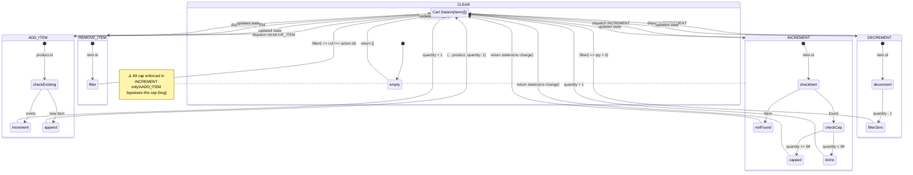
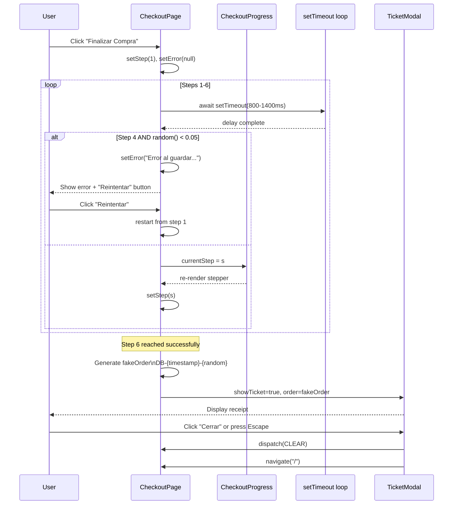

# Application Flows — DotaBURGUERS

> Referencia completa de los 11 flujos de aplicación existentes, pipelines de datos,
> máquinas de estado y secuencias de autenticación en la aplicación demo DotaBURGUERS.

**Última actualización**: 2026-06-28
**Stack**: React 19 + Vite 8 + Tailwind CSS v4 + React Router v7
**Auth**: DummyJSON API (solo username, sin password)
**Persistencia**: localStorage (cart + user)
**Archivos fuente**: 15 (3 contextos, 4 páginas, 7 componentes, 1 archivo de datos)

---

## Tabla de Contenidos

- [Inventario de Flujos](#inventario-de-flujos)
- [Flow 1: Navegación / Routing](#flow-1-navegación--routing)
- [Flow 2: Autenticación (Login)](#flow-2-autenticación-login)
- [Flow 3: Gestión del Carrito (CRUD)](#flow-3-gestión-del-carrito-crud)
- [Flow 4: Simulación de Checkout](#flow-4-simulación-de-checkout)
- [Flow 5: Filtrado y Búsqueda de Productos](#flow-5-filtrado-y-búsqueda-de-productos)
- [Flow 6: Agregar al Carrito (desde Product Card)](#flow-6-agregar-al-carrito-desde-product-card)
- [Flow 7: Cart Summary → Navegación a Checkout](#flow-7-cart-summary--navegación-a-checkout)
- [Flow 8: Menú de Usuario en Header](#flow-8-menú-de-usuario-en-header)
- [Flow 9: Ticket Modal Post-Checkout](#flow-9-ticket-modal-post-checkout)
- [Flow 10: Checkout Progress Stepper](#flow-10-checkout-progress-stepper)
- [Flow 11: Footer Navigation](#flow-11-footer-navigation)
- [Appendix A: Diagramas Mermaid](#appendix-a-diagramas-mermaid)
- [Appendix B: Pseudocódigo](#appendix-b-pseudocódigo)
- [Appendix C: Flujos Faltantes (12)](#appendix-c-flujos-faltantes-12)
- [Appendix D: Bug Log](#appendix-d-bug-log)

---

## Inventario de Flujos

| # | Flow | Archivo(s) Principal(es) | Tipo | Auth |
|---|------|--------------------------|------|------|
| 1 | Navegación / Routing | `src/App.jsx` | Infraestructura | No |
| 2 | Autenticación (Login) | `src/context/AuthContext.jsx`, `src/pages/LoginPage.jsx` | Async API | Sí |
| 3 | Gestión del Carrito (CRUD) | `src/context/CartContext.jsx`, `src/pages/CartPage.jsx`, `src/components/CartItem.jsx` | Reducer | No |
| 4 | Simulación de Checkout | `src/pages/CheckoutPage.jsx` | Async Step Machine | Sí |
| 5 | Filtrado y Búsqueda de Productos | `src/pages/HomePage.jsx`, `src/data/products.js` | Pipeline (useMemo) | No |
| 6 | Agregar al Carrito | `src/components/ProductCard.jsx` → `CartContext.jsx` | Dispatch | No |
| 7 | Cart Summary → Checkout | `src/components/CartSummary.jsx` | Auth Gate + Display | Dual |
| 8 | Menú de Usuario (Header) | `src/components/Header.jsx` | UI + Auth | Dual |
| 9 | Ticket Modal Post-Checkout | `src/components/TicketModal.jsx` | Modal + Receipt | Sí |
| 10 | Checkout Progress Stepper | `src/components/CheckoutProgress.jsx` | Display | Sí |
| 11 | Footer Navigation | `src/components/Footer.jsx` | Static UI | No |

---

## Flow 1: Navegación / Routing

**Archivo**: `src/App.jsx` (L9–L27)

**Propósito**: Define la estructura de providers y las rutas principales de la SPA, incluyendo guards a nivel componente.

**Trigger**: El usuario accede a cualquier URL de la aplicación.

**Puntos de salida**: Renderizado del componente de página correspondiente o redirect.

**Estructura de Providers**:

```
BrowserRouter
  └── AuthProvider         (src/context/AuthContext.jsx)
       └── CartProvider    (src/context/CartContext.jsx)
            └── Routes
```

**Rutas definidas** (App.jsx L15–L21):

| Ruta | Componente | Tipo | Auth Required |
|------|-----------|------|---------------|
| `/` | `HomePage` | Pública | No |
| `/carrito` | `CartPage` | Pública | No |
| `/login` | `LoginPage` | Pública | No |
| `/checkout` | `CheckoutPage` | Protegida por guard | Sí (con check de items) |
| `*` | `Navigate to="/"` | Catch-all redirect | No |

**Decision Points**:

- La ruta `/checkout` NO tiene un guard a nivel de router — la protección se hace **dentro** del componente `CheckoutPage` mediante un `useEffect` (CheckoutPage.jsx L30–L37):
  - Si `items.length === 0` → redirect a `/`
  - Si `!user` → redirect a `/login`
- Catch-all (`*`) redirige siempre a `/`, evitando páginas 404.

**Data Involved**:
- **Read**: `user` (AuthContext), `items` (CartContext) — solo en CheckoutPage

**Edge Cases**:
- Acceso directo a `/checkout` sin items → redirect a home
- Acceso directo a `/checkout` sin sesión → redirect a login
- Ruta inexistente → catch-all redirect a `/`

> **Diagrama asociado**: Ver [Fig. E: Navegación + Auth Gate](#fig-e-navegación--auth-gate)

---

## Flow 2: Autenticación (Login)

**Archivo**: `src/context/AuthContext.jsx` (L5–L61), `src/pages/LoginPage.jsx` (L5–L142)

**Propósito**: Permitir que el usuario inicie sesión con su username contra la API de DummyJSON, persista la sesión en localStorage, y pueda cerrarla.

### 2.1 Restauración de Sesión (AuthContext.jsx L8–L17)

Al montar `AuthProvider`:
1. Lee `localStorage.getItem("dotaburgers-user")`
2. Si existe y es JSON válido → `setUser(JSON.parse(raw))`
3. Si el JSON es inválido → `localStorage.removeItem(...)` (corrupción silenciosa)

### 2.2 Login (AuthContext.jsx L19–L43 + LoginPage.jsx L29–L45)

**Trigger**: El usuario completa el formulario de login y hace submit.

**Pasos**:
1. `handleSubmit` captura el evento (LoginPage.jsx L29)
2. Validación: si `username.trim()` está vacío → **no-op**, sin feedback (L31)
3. `setLoading(true)`, `setError("")` (L33–L34)
4. Llama a `login(username.trim())` — retorna una Promise (AuthContext.jsx L19)
5. `fetch()` a `https://dummyjson.com/users/filter?key=username&value=...`
6. Si `!res.ok` → `throw new Error("Error de conexión")`
7. Si `data.users.length === 0` → `throw new Error("Usuario no encontrado")`
8. Éxito: extrae `{ id, username, firstName, lastName, email, image }` (L28–L34)
9. `setUser(userData)`, `localStorage.setItem(...)` (L36–L37)
10. `navigate("/checkout")` (LoginPage.jsx L38)

**Puntos de salida**:
- Éxito: redirección a `/checkout`
- Error: mensaje de error en pantalla + animación shake (LoginPage.jsx L40–L41)

**3 Caminos de Error**:
1. Username vacío → **sin feedback** (no-op silencioso)
2. Error de red / HTTP error → `"Error de conexión"`
3. Username no encontrado → `"Usuario no encontrado"`

**Animación Shake** (LoginPage.jsx L13–L27): Animación CSS via Web Animations API que desplaza el input horizontalmente durante 400ms.

**Data Involved**:
- **Read**: `username` (estado local LoginPage)
- **Write**: `user` (AuthContext state), `localStorage` (`dotaburgers-user`)
- **API**: `GET https://dummyjson.com/users/filter?key=username&value={username}`

**Edge Cases**:
- Usuario ya logueado que visita `/login` — NO hay redirect, muestra el form igual
- Doble submit durante `loading=true` — el botón se deshabilita (`disabled`)
- Corrupción de localStorage en el mount — se elimina la entrada corrupta
- Sesión expirada (no hay mecanismo — DummyJSON no tiene tokens expirables)

### 2.3 Logout (AuthContext.jsx L45–L48)

**Trigger**: El usuario hace clic en "Cerrar sesión" en el menú del Header (Header.jsx L91).

**Pasos**:
1. `setUser(null)` — limpia estado React
2. `localStorage.removeItem("dotaburgers-user")` — limpia persistencia

**Sin llamada API** — el logout es puramente local.

> **Diagrama asociado**: Ver [Fig. A: Auth Login Flowchart](#fig-a-auth-login-flowchart)
> **Pseudocódigo asociado**: Ver [P1: Login Flow](#p1-login-flow)

---

## Flow 3: Gestión del Carrito (CRUD)

**Archivo**: `src/context/CartContext.jsx` (L5–L78), `src/pages/CartPage.jsx` (L8–L80), `src/components/CartItem.jsx` (L3–L59)

**Propósito**: Implementar un carrito de compras completo con 5 operaciones (ADD, REMOVE, INCREMENT, DECREMENT, CLEAR) manejadas por un `useReducer` con persistencia en localStorage.

### 3.1 Inicialización (CartContext.jsx L5–L12, L48–L49)

- `loadCart()`: función initializer que lee `localStorage.getItem("dotaburgers-cart")`
- Si no existe o hay error de parse → retorna `[]` (array vacío)
- `useReducer(cartReducer, [], loadCart)` — el tercer argumento es el initializer lazy

### 3.2 Las 5 Acciones del Reducer (CartContext.jsx L14–L46)

#### ADD_ITEM (L16–L26)
```
Buscar item existente por product.id
├── Si existe → mapear y sumar +1 a quantity
└── Si no existe → agregar nuevo item con quantity: 1
⚠️ BUG: NO verifica el límite de >= 99 (ver Bug Log)
```

#### REMOVE_ITEM (L27–L28)
```
RETURN state.filter(item => item.id !== action.id)
```

#### INCREMENT (L29–L36)
```
Buscar item por action.id
├── Si no existe → return state (no-op)
├── Si quantity >= 99 → return state (hard cap)
└── Sino → mapear y sumar +1 a quantity
✅ Único action que respeta el cap de 99
```

#### DECREMENT (L37–L40)
```
Mapear todos los items restando 1 al que coincide
Filtrar items con quantity > 0
→ Si quantity llega a 0, el item se elimina automáticamente
```

#### CLEAR (L41–L42)
```
RETURN []  — carrito vacío
```

### 3.3 Persistencia (CartContext.jsx L51–L53)

```js
useEffect(() => {
  localStorage.setItem("dotaburgers-cart", JSON.stringify(items));
}, [items]);
```

Cada cambio en `items` persiste automáticamente el array completo en localStorage.

### 3.4 Valores Calculados (CartContext.jsx L55–L59)

| Variable | Fórmula | Descripción |
|----------|---------|-------------|
| `totalItems` | `items.reduce((sum, i) => sum + i.qty, 0)` | Cantidad total de productos |
| `subtotal` | `items.reduce((sum, i) => sum + i.price * i.qty, 0)` | Suma sin impuestos |
| `discount` | `subtotal > 500 ? subtotal * 0.1 : 0` | 10% de descuento por mayoreo |
| `iva` | `(subtotal - discount) * 0.16` | IVA 16% |
| `total` | `subtotal - discount + iva` | Total final |

### 3.5 Interfaz de Usuario (CartPage.jsx + CartItem.jsx)

**CartPage**:
- Lista items con `CartItem` por cada uno
- Botón "Vaciar carrito" con `window.confirm()` (CartPage.jsx L12–L16)
- Si `items.length === 0` → muestra empty state con link "Ver Menú"

**CartItem**:
- Botón `−` → dispatch `DECREMENT` (CartItem.jsx L35)
- Display de cantidad (L41–L43)
- Botón `+` → dispatch `INCREMENT` (L45)
- Botón `🗑️` → dispatch `REMOVE_ITEM` (L20)

**Trigger**: Cualquier interacción del usuario en los botones del carrito.
**Puntos de salida**: Estado actualizado del carrito + re-render de componentes dependientes.
**Edge Cases**:
- DECREMENT a 0 → el item desaparece del array (no queda con quantity 0)
- INCREMENT a 99 → hard cap, no se puede superar
- ADD_ITEM de producto ya existente → incrementa quantity (no duplica)
- Carrito vacío → todo el flujo de render condicional muestra empty state

> **Diagrama asociado**: Ver [Fig. B: Cart Reducer State Diagram](#fig-b-cart-reducer-state-diagram)
> **Pseudocódigo asociado**: Ver [P2: Cart Reducer](#p2-cart-reducer)

---

## Flow 4: Simulación de Checkout

**Archivo**: `src/pages/CheckoutPage.jsx` (L10–L207)

**Propósito**: Simular un proceso de checkout de 6 pasos con delays aleatorios, una tasa de fallo del 5% en el paso 4, y generación de orden ficticia.

### 4.1 Guard Rails (CheckoutPage.jsx L30–L37)

```js
useEffect(() => {
  if (items.length === 0 && step === 0) navigate("/");
  if (!user && step === 0) navigate("/login");
}, [items, user, step, navigate]);
```

Se ejecuta en cada mount y cuando cambian las dependencias. Solo redirige si `step === 0` (estado inicial).

### 4.2 Definición de Pasos (CheckoutPage.jsx L10–L18)

| Step | Título | Ícono |
|------|--------|-------|
| 0 | "Finalizar Compra" | `null` |
| 1 | "Validando conexión..." | `wifi` |
| 2 | "Verificando disponibilidad..." | `inventory_2` |
| 3 | "Calculando total..." | `sync` |
| 4 | "Guardando pedido..." | `save` |
| 5 | "Guardando historial..." | `history` |
| 6 | "¡Compra completada!" | `check_circle` |

### 4.3 startCheckout() (CheckoutPage.jsx L39–L64)

```
INICIO: setStep(1), setError(null)
LOOP: steps [1,2,3,4,5,6] → secuencial
  POR CADA s:
    AWAIT setTimeout(800 + Math.random() * 600)  // delay 800-1400ms
    SI s === 4 AND Math.random() < 0.05:
      SET error = "Error al guardar el pedido. Intenta de nuevo."
      RETURN  // sale del loop, muestra error UI
    SET step = s  // actualiza progreso
  FIN LOOP

  // Éxito
  fakeOrder = {
    id: "DB-" + Date.now().toString(36).toUpperCase() + "-" + random(0-9999),
    date: new Date().toISOString()
  }
  SET order = fakeOrder
  SET showTicket = true
```

### 4.4 handleRetry() (CheckoutPage.jsx L66–L69)

- Limpia el error
- Reinicia `startCheckout()` desde el **paso 1** (no desde el paso 4)

### 4.5 Estados Visuales (CheckoutPage.jsx L90–L157)

| Condición | UI | Acción |
|-----------|-----|--------|
| `error != null` | Icono error + mensaje + botón "Reintentar" | `handleRetry()` |
| `step === 0` | Resumen + botón "Finalizar Compra" | `startCheckout()` |
| `step === 6` | Check verde + mensaje éxito + TicketModal | Auto-show ticket |
| `step >= 1` | Spinner + título + descripción del paso | — |

**Trigger**: Click en "Finalizar Compra" (step 0 → 1).
**Puntos de salida**: TicketModal (éxito) o pantalla de error (fallo + reintento).
**Edge Cases**:
- Falla en step 4 → reintento desde step 1 (no desde step 4)
- Usuario navega a otra página durante el proceso → sin protección (useEffect solo redirige en step 0)
- Múltiples checkouts → cada uno genera un nuevo fakeOrder

> **Diagrama asociado**: Ver [Fig. C: Checkout Sequence](#fig-c-checkout-sequence)
> **Pseudocódigo asociado**: Ver [P3: Checkout Simulation](#p3-checkout-simulation)

---

## Flow 5: Filtrado y Búsqueda de Productos

**Archivo**: `src/pages/HomePage.jsx` (L8–L199), `src/data/products.js` (L1–L84)

**Propósito**: Pipeline de 4 etapas (Categoría → Búsqueda → Orden → Render/Empty) envuelto en `useMemo` para transformar el array estático de productos en la lista filtrada.

### 5.1 Estados del Pipeline (HomePage.jsx L9–L11)

```js
const [searchTerm, setSearchTerm] = useState("");
const [activeCategory, setActiveCategory] = useState("Todas");
const [sortBy, setSortBy] = useState("featured");
```

### 5.2 Pipeline (HomePage.jsx L14–L52)

```
DEPENDENCIAS useMemo: [searchTerm, activeCategory, sortBy]

1. SHALLOW COPY: result = [...products]

2. FILTRO POR CATEGORÍA (L18-L20)
   SI activeCategory !== "Todas":
     result = result.filter(p => p.category === activeCategory)

3. FILTRO POR BÚSQUEDA (L23-L31)
   SI searchTerm.trim() es truthy:
     query = searchTerm.toLowerCase()
     result = result.filter(p =>
       p.name.toLowerCase().includes(query) OR
       p.description.toLowerCase().includes(query) OR
       p.category.toLowerCase().includes(query)
     )

4. ORDENAMIENTO (L33-L49)
   SEGÚN sortBy:
     "price-asc":   sort((a,b) => a.price - b.price)
     "price-desc":  sort((a,b) => b.price - a.price)
     "name-asc":    sort((a,b) => a.name.localeCompare(b.name))
     "name-desc":   sort((a,b) => b.name.localeCompare(a.name))
     "featured" | default: sin sort (orden original)

RESULT: filtered[]
```

### 5.3 Render (HomePage.jsx L119–L138)

- Si `filtered.length === 0` → Empty State: icono `search_off`, "No se encontraron productos", sugerencia de cambiar búsqueda (L120–L131)
- Si `filtered.length > 0` → Grid responsivo: 1 col (sm), 2 col (lg), 4 col (xl) con `ProductCard` (L133–L137)

### 5.4 Controles de UI

- **Categorías**: Botones horizontales (HomePage.jsx L86–L98) — mapea `categories` del data file
- **Sort**: Dropdown select (L101–L116) con 5 opciones
- **Búsqueda**: Input en Header (via prop `showSearch`, L31–L46 de Header.jsx) — integrado por `searchTerm` y `onSearchChange`

**Trigger**: Cambio en cualquiera de los 3 estados (categoría, búsqueda, sort).
**Puntos de salida**: Grid de productos actualizado o empty state.
**Data Involved**:
- **Read**: `products[]` (static, 8 items), `searchTerm`, `activeCategory`, `sortBy`
- **Write**: Ninguno — pipeline puro de transformación

**Edge Cases**:
- Búsqueda sin filtro de categoría → busca en todos los productos
- Categoría sin búsqueda → muestra todos los de esa categoría
- Búsqueda que no coincide → empty state
- Sort "featured" → preserva el orden original del array de datos
- Hero banner y Recommendations sections son **estáticos** — NO pasan por el pipeline

> **Diagrama asociado**: Ver [Fig. D: Product Filter Pipeline](#fig-d-product-filter-pipeline)
> **Pseudocódigo asociado**: Ver [P4: Filter Pipeline](#p4-filter-pipeline)

---

## Flow 6: Agregar al Carrito (desde Product Card)

**Archivo**: `src/components/ProductCard.jsx` (L3–L43)

**Propósito**: Bridge entre la UI de producto y el reducer del carrito — el usuario agrega un producto desde la grilla de HomePage.

**Trigger**: Click en el botón `+` (círculo primary, L33–L39) de cualquier `ProductCard`.

**Pasos**:
1. Click en botón con aria-label `"Agregar ${product.name} al carrito"` (L35)
2. Dispatch: `dispatch({ type: "ADD_ITEM", product })` (L34)
3. El reducer procesa ADD_ITEM (ver [Flow 3](#flow-3-gestión-del-carrito-crud)):
   - Si el producto ya existe → incrementa quantity
   - Si es nuevo → agrega con quantity: 1

**Puntos de salida**: Estado del carrito actualizado → badge del Header se actualiza.

**Edge Cases**:
- Item ya en carrito → incrementa, no duplica
- Sin feedback visual directo (no toast, no animación) — solo se actualiza el badge

---

## Flow 7: Cart Summary → Navegación a Checkout

**Archivo**: `src/components/CartSummary.jsx` (L5–L80)

**Propósito**: Mostrar resumen de precios del carrito y proveer un auth gate para navegar a checkout.

### 7.1 Auth Gate (CartSummary.jsx L12–L18)

```js
function handleCheckout() {
  if (user) navigate("/checkout");
  else navigate("/login");
}
```

**Trigger**: Click en botón "Finalizar Compra" (L59–L63).

### 7.2 Desglose de Precios (L27–L55)

| Item | Condición |
|------|-----------|
| Subtotal (N items) | Siemvisible |
| IVA 16% | Siemvisible |
| Descuento por Mayoreo (10%) | Solo si `discount > 0` (subtotal > $500) |
| Total | Siemvisible |

### 7.3 Botones

- **"Finalizar Compra"** (L58–L64): Dispara auth gate → checkout o login
- **"Seguir Comprando"** (L66–L71): `navigate("/")` — vuelve al home
- **"Pago Seguro"** (L74–L77): Texto decorativo con icono de candado — sin funcionalidad real

**Data Involved**:
- **Read**: `items`, `subtotal`, `discount`, `iva`, `total` (CartContext)
- **Write**: Ninguno (solo navegación)

**Edge Cases**:
- Carrito vacío → CartSummary solo se renderiza cuando hay items (CartPage.jsx L50)
- Subtotal < $500 → descuento oculto, se ve la línea de IVA directamente
- Usuario no autenticado → redirect a login en vez de checkout

---

## Flow 8: Menú de Usuario en Header

**Archivo**: `src/components/Header.jsx` (L6–L102)

**Propósito**: Header sticky con logo, búsqueda (condicional), badge del carrito y menú de usuario con comportamiento dual (logueado / no logueado).

### 8.1 Badge del Carrito (Header.jsx L55–L59)

```js
{totalItems > 0 && (
  <span className="...">
    {totalItems > 99 ? "99+" : totalItems}
  </span>
)}
```

- Solo visible si `totalItems > 0`
- Trunca a "99+" si supera 99

### 8.2 Comportamiento Dual del Botón de Usuario (Header.jsx L62–L82)

| Estado | Click | UI |
|--------|-------|-----|
| `user` existe | Toggle `menuOpen` | Foto de perfil + nombre (desktop) |
| `!user` | `navigate("/login")` | Icono `account_circle` |

### 8.3 Dropdown Menu (Header.jsx L84–L97)

Visible solo cuando `menuOpen && user`:
- Información del usuario: nombre completo + email (L86–L89)
- Botón "Cerrar sesión" (L91): `logout()` + `setMenuOpen(false)` + `navigate("/")`

### 8.4 Click-Outside Listener (Header.jsx L13–L21)

```js
useEffect(() => {
  function handleClick(e) {
    if (menuRef.current && !menuRef.current.contains(e.target)) setMenuOpen(false);
  }
  document.addEventListener("mousedown", handleClick);
  return () => document.removeEventListener("mousedown", handleClick);
}, []);
```

Cierra el menú cuando se hace clic fuera del `menuRef`.

### 8.5 Búsqueda (Header.jsx L31–L46)

Render condicional: solo se muestra cuando `showSearch=true` (HomePage lo pasa como prop).
Input con icono de search, vinculado a `searchTerm` y `onSearchChange` del HomePage.

**Trigger**: Cualquier interacción del usuario en el Header.
**Puntos de salida**: Menú abierto/cerrado, navegación a `/login` o `/carrito`, dispatch de logout.
**Edge Cases**:
- Click-outside cierra el menú
- 99+ badge truncation
- Usuario sin foto de perfil → icono `account_circle`

---

## Flow 9: Ticket Modal Post-Checkout

**Archivo**: `src/components/TicketModal.jsx` (L5–L124)

**Propósito**: Modal tipo recibo que muestra el resumen de la compra después de un checkout exitoso, con opción de cerrar (que limpia el carrito y redirige al home).

### 9.1 Apertura (CheckoutPage.jsx L62–L63, L203)

```js
setOrder(fakeOrder);
setShowTicket(true);
// ...
{showTicket && order && <TicketModal order={order} onClose={() => setShowTicket(false)} />}
```

### 9.2 Escape Key Listener (TicketModal.jsx L9–L15)

```js
useEffect(() => {
  function handleKey(e) {
    if (e.key === "Escape") handleClose();
  }
  document.addEventListener("keydown", handleKey);
  return () => document.removeEventListener("keydown", handleKey);
}, []);
```

### 9.3 handleClose (TicketModal.jsx L17–L21)

```js
function handleClose() {
  dispatch({ type: "CLEAR" });   // Vacía el carrito
  onClose?.();                     // Cierra el modal (setShowTicket(false))
  navigate("/");                   // Redirige al home
}
```

### 9.4 Estructura del Recibo (L34–L123)

1. **Header**: Logo "DotaBURGUERS" + "¡Gracias por tu compra!" (L43–L50)
2. **Order Info**: ID de orden + fecha y hora formateadas con locale `es-MX` (L54–L61)
3. **Lista de Productos**: Nombre, cantidad x, subtotal por item (L69–L84)
4. **Totales**: Subtotal, descuento condicional, IVA, Total (L88–L107)
5. **Footer**: Texto decorativo sobre email de confirmación (L110–L112)
6. **Botón "Cerrar"** (L114–L119): Dispara `handleClose`

**Trigger**: Checkout exitoso (step 6 alcanzado).
**Puntos de salida**: Carrto vaciado + redirección a home.
**Edge Cases**:
- Escape key cierra el modal
- Clic en "Cerrar" limpia el carrito (no vuelve a la tienda con items)
- Fecha formateada con `es-MX` (México) — día, mes, año en español
- Si `discount === 0`, la línea de descuento no se muestra

---

## Flow 10: Checkout Progress Stepper

**Archivo**: `src/components/CheckoutProgress.jsx` (L1–L72)

**Propósito**: Componente de presentación que visualiza el progreso del checkout en 6 pasos con barra de progreso y estados (completado, activo, pendiente).

### 10.1 Definición de Pasos (CheckoutProgress.jsx L1–L8)

```js
const STEPS = [
  { key: 1, label: "Conexión" },
  { key: 2, label: "Inventario" },
  { key: 3, label: "Total" },
  { key: 4, label: "Firestore" },
  { key: 5, label: "Historial" },
  { key: 6, label: "Completado" },
];
```

### 10.2 Barra de Progreso (L11–L13, L18–L22)

```js
const progressPercent = currentStep > 1
  ? Math.min(((currentStep - 1) / (STEPS.length - 1)) * 100, 100)
  : 0;
```

La barra se llena desde 0% hasta 100% con transición CSS de 500ms.

### 10.3 Estados de Cada Step (L27–L29, L34–L55)

| Estado | Condición | Visual |
|--------|-----------|--------|
| `isCompleted` | `currentStep > step.key` | Círculo verde con checkmark |
| `isActive` | `currentStep === step.key` | Círculo vacío con borde primary + dot pulsante |
| `isPending` | `currentStep < step.key` | Círculo gris opaco con número |

### 10.4 Labels (L57–L65)

Ocultos en mobile (`hidden md:block`). Color primary para completed/active, gris para pending.

**Trigger**: Cambio en `currentStep` prop (recibido de CheckoutPage).
**Puntos de salida**: Re-render del stepper con nuevo estado visual.
**Edge Cases**:
- `currentStep` en 1 → 0% de progreso (protección con `currentStep > 1`)
- `currentStep` en 6 → 100% de progreso
- Mobile: solo se ven los círculos, sin labels

---

## Flow 11: Footer Navigation

**Archivo**: `src/components/Footer.jsx` (L1–L26)

**Propósito**: Footer estático con logo, enlaces de navegación y copyright.

**Trigger**: Renderizado del layout en HomePage y CartPage.

**Estructura**:

```
Footer (bg-surface-container-low, border-top)
├── Logo: "DotaBURGUERS" (L4–L5)
├── Nav: 4 enlaces (L7–L19)
│   ├── "Aviso de Privacidad" → #
│   ├── "Términos del Servicio" → #
│   ├── "Contacto" → #
│   └── "Soporte" → #
└── Copyright: "© 2024 DotaBURGUERS. Todos los derechos reservados." (L21–L23)
```

**Data Involved**: Ninguno — contenido estático.

**Edge Cases**:
- Todos los links apuntan a `#` (sin navegación real)
- No hay estado vacío — el contenido es siempre el mismo
- Responsive: cambia de `row` (desktop) a `column` (mobile)

---

## Appendix A: Diagramas Mermaid

### Fig. A: Auth Login Flowchart

```mermaid
flowchart TD
    classDef start fill:#1a1a2e,color:#fff,stroke:#1a1a2e,stroke-width:2px
    classDef decision fill:#f59e0b,color:#000,stroke:#d97706,stroke-width:2px
    classDef action fill:#3b82f6,color:#fff,stroke:#2563eb,stroke-width:2px
    classDef success fill:#10b981,color:#fff,stroke:#059669,stroke-width:2px
    classDef failure fill:#ef4444,color:#fff,stroke:#dc2626,stroke-width:2px

    A((Start)) --> B[User types username]
    B --> C{username.trim()\nis empty?}
    C -->|Yes| D[no-op: return\n(no feedback)]
    C -->|No| E[Set loading=true\nClear errors]
    E --> F[fetch DummyJSON\n/users/filter]
    F --> G{res.ok?}
    G -->|No| H[Throw\n"Error de conexión"]
    G -->|Yes| I{data.users.length\n> 0?}
    I -->|No| J[Throw\n"Usuario no encontrado"]
    I -->|Yes| K[Extract user:\nid, username, firstName\nlastName, email, image]
    K --> L[setUser +\nlocalStorage.setItem]
    L --> M[navigate("/checkout")]
    H --> N[setError + shakeInput]
    J --> N
    N --> B

    class A start
    class C,G,I decision
    class B,E,F,K,L action
    class M success
    class H,J,N failure
```

**Fig. A**: Diagrama de flujo del login. Muestra 14 nodos (A–N) con 3 caminos de error y la ruta exitosa que persiste en localStorage y redirige a `/checkout`. La restauración de sesión en el mount de AuthProvider es un mini-flujo separado que no está representado aquí.

---

### Fig. B: Cart Reducer State Diagram



**Fig. B**: Diagrama de estados del reducer del carrito. Las 5 acciones (ADD_ITEM, INCREMENT, DECREMENT, REMOVE_ITEM, CLEAR) son sub-máquinas con sus propias transiciones internas. Notar que el cap de 99 solo se aplica en INCREMENT — ADD_ITEM no tiene esta protección (bug documentado).

---

### Fig. C: Checkout Sequence



**Fig. C**: Diagrama de secuencia del checkout. El loop simula 6 pasos con delays aleatorios. El 5% de fallo ocurre solo en step 4. El reintento arranca desde step 1, no desde step 4. El guard useEffect (items + user) es un pre-check que no está representado en esta secuencia.

---

### Fig. D: Product Filter Pipeline

```mermaid
flowchart LR
    classDef data fill:#8b5cf6,color:#fff,stroke:#7c3aed,stroke-width:2px
    classDef process fill:#3b82f6,color:#fff,stroke:#2563eb,stroke-width:2px
    classDef decision fill:#f59e0b,color:#000,stroke:#d97706,stroke-width:2px
    classDef output fill:#10b981,color:#fff,stroke:#059669,stroke-width:2px
    classDef empty fill:#ef4444,color:#fff,stroke:#dc2626,stroke-width:2px

    A["products[]\n(8 items)"]:::data --> B{activeCategory\n!== "Todas"?}
    B -->|Yes| C["filter by\np.category === cat"]:::process
    B -->|No| D["pass through"]:::process
    C --> E["filtered set"]:::data
    D --> E
    E --> F{searchTerm\n.trim() truthy?}
    F -->|Yes| G["filter by\nname OR description\nOR category\n(lowercase match)"]:::process
    F -->|No| H["pass through"]:::process
    G --> I["filtered set"]:::data
    H --> I
    I --> J{sortBy !==\n"featured"?}
    J -->|Yes| K["sort pipeline\n(price-asc/desc,\nname-asc/desc)"]:::process
    J -->|No| L["original order"]:::process
    K --> M["sorted set"]:::data
    L --> M
    M --> N{filtered.length\n=== 0?}
    N -->|Yes| O["Empty State:\nsearch_off icon\n'No se encontraron\nproductos'"]:::empty
    N -->|No| P["Product Grid\n(responsive 1-4 cols)"]:::output

    class A,E,I,M data
    class C,D,G,H,K,L process
    class B,F,J,N decision
    class P output
    class O empty
```

**Fig. D**: Pipeline de filtrado LR (left-to-right). Las 4 etapas secuenciales son: Categoría → Búsqueda → Sort → Render/Empty. El pipeline completo está envuelto en `useMemo` y solo se recalcula cuando cambian `[searchTerm, activeCategory, sortBy]`. Hero banner y Recommendations son componentes estáticos fuera del pipeline.

---

### Fig. E: Navegación + Auth Gate

```mermaid
flowchart TD
    classDef url fill:#1a1a2e,color:#fff,stroke:#1a1a2e,stroke-width:2px
    classDef page fill:#3b82f6,color:#fff,stroke:#2563eb,stroke-width:2px
    classDef decision fill:#f59e0b,color:#000,stroke:#d97706,stroke-width:2px
    classDef protected fill:#8b5cf6,color:#fff,stroke:#7c3aed,stroke-width:2px
    classDef redirect fill:#ef4444,color:#fff,stroke:#dc2626,stroke-width:2px
    classDef public fill:#10b981,color:#fff,stroke:#059669,stroke-width:2px

    B["BrowserRouter"]:::url ==> P["AuthProvider"]:::url
    P ==> C["CartProvider"]:::url
    C ==> ROUTES

    subgraph ROUTES [Routes]
        direction TB
        H["/" → HomePage]:::public
        CART["/carrito" → CartPage]:::public
        L["/login" → LoginPage]:::public
        CHK["/checkout" → CheckoutPage]:::protected
        STAR["*" → redirect to /]:::redirect
    end

    CHK --> G1{items.length\n=== 0?}
    G1 -->|Yes| R1[navigate("/")]:::redirect
    G1 -->|No| G2{!user?}
    G2 -->|Yes| R2[navigate("/login")]:::redirect
    G2 -->|No| RENDER["Render CheckoutPage"]:::page

    CART --> CS["CartSummary"]:::page
    CS --> G3{user?}
    G3 -->|Yes| NAV_CHK[navigate("/checkout")]:::redirect
    G3 -->|No| NAV_LOG[navigate("/login")]:::redirect

    H --> NAV["Header user icon"]:::page
    NAV --> G4{user?}
    G4 -->|Yes| DROPDOWN["Show dropdown menu"]:::page
    G4 -->|No| NAV_LOG2[navigate("/login")]:::redirect

    class B,P,C url
    class H,CART,L public
    class CHK protected
    class R1,R2,NAV_CHK,NAV_LOG,NAV_LOG2 redirect
```

**Fig. E**: Diagrama de navegación y auth gates. Muestra los 3 niveles de protección:
1. **Route-level**: `/checkout` sin guard directo (el componente se protege solo)
2. **Component-level**: `CheckoutPage` con useEffect que verifica items y user
3. **Component-level**: `CartSummary` con auth gate en `handleCheckout`
4. **UI-level**: Header con comportamiento dual según `user`

---

## Appendix B: Pseudocódigo

### P1: Login Flow

```pseudocode
// Archivo: src/context/AuthContext.jsx (L19-L42) + src/pages/LoginPage.jsx (L29-L45)
// Flujo asincrónico de login con 3 caminos de error, sincronización con localStorage y redirect

INPUT: username (string del input)
OUTPUT: userData OR lanza Error
SIDE EFFECTS: setUser(), localStorage.setItem(), navigate("/checkout")

FUNCTION login(username):                          // AuthContext.jsx
    RETURN fetch(
        "https://dummyjson.com/users/filter" +
        "?key=username&value=" + encodeURIComponent(username)
    )
    .THEN(res =>
        IF NOT res.ok:
            THROW new Error("Error de conexión")
        RETURN res.json()
    )
    .THEN(data =>
        IF data.users.length === 0:
            THROW new Error("Usuario no encontrado")

        u = data.users[0]
        userData = {
            id: u.id,
            username: u.username,
            firstName: u.firstName,
            lastName: u.lastName,
            email: u.email,
            image: u.image
        }

        setUser(userData)                            // React state
        localStorage.setItem("dotaburgers-user",     // Persistencia
            JSON.stringify(userData)
        )
        RETURN userData
    )

// ===== Llamada desde LoginPage =====

FUNCTION handleSubmit(e):                            // LoginPage.jsx
    e.preventDefault()

    // Validation gate
    IF username.trim() IS empty:
        RETURN  // no-op, sin feedback

    SET loading = true
    CLEAR error

    TRY:
        AWAIT login(username.trim())
        navigate("/checkout")                        // Redirect
    CATCH err:
        setError(err.message)                        // Muestra error en UI
        shakeInput()                                 // Animación CSS (400ms)
    FINALLY:
        SET loading = false
```

---

### P2: Cart Reducer

```pseudocode
// Archivo: src/context/CartContext.jsx (L14-L46)
// Función reductora pura manejando 5 acciones con condiciones de borde

INPUT: state (items[]), action { type, payload }
OUTPUT: newState (items[])

FUNCTION cartReducer(state, action):
    SWITCH action.type:

        CASE "ADD_ITEM":
            existing = state.find(item => item.id === action.product.id)
            IF existing:
                RETURN state.map(item =>
                    item.id === action.product.id
                        ? { ...item, quantity: item.quantity + 1 }
                        : item
                )
            ELSE:
                RETURN [...state, { ...action.product, quantity: 1 }]
            // ⚠️ BUG: No hay chequeo >= 99 aquí (ver Bug Log)

        CASE "REMOVE_ITEM":
            RETURN state.filter(item => item.id !== action.id)

        CASE "INCREMENT":
            item = state.find(i => i.id === action.id)
            IF NOT item:
                RETURN state  // item no encontrado — sin cambios
            IF item.quantity >= 99:
                RETURN state  // hard cap — sin cambios
            RETURN state.map(i =>
                i.id === action.id
                    ? { ...i, quantity: i.quantity + 1 }
                    : i
            )

        CASE "DECREMENT":
            // Mapea para decrementar, luego filtra items en 0
            RETURN state
                .map(i =>
                    i.id === action.id
                        ? { ...i, quantity: i.quantity - 1 }
                        : i
                )
                .filter(i => i.quantity > 0)

        CASE "CLEAR":
            RETURN []

        DEFAULT:
            RETURN state
```

---

### P3: Checkout Simulation

```pseudocode
// Archivo: src/pages/CheckoutPage.jsx (L39-L69)
// Simulación asincrónica de 6 pasos con delays aleatorios, 5% de fallo y reintento

INPUT: items[] (de CartContext), user (de AuthContext)
OUTPUT: fakeOrder { id, date } OR detención por error
SIDE EFFECTS: setStep(), setError(), setOrder(), setShowTicket()

// Guard rails (useEffect — se ejecuta al montar y al cambiar dependencias)
IF items.length === 0 AND step === 0:
    navigate("/")
    RETURN
IF NOT user AND step === 0:
    navigate("/login")
    RETURN

FUNCTION startCheckout():
    SET step = 1
    CLEAR error

    STEPS = [1, 2, 3, 4, 5, 6]

    FOR EACH s IN STEPS:
        // Delay aleatorio: 800-1400ms
        AWAIT setTimeout(800 + Math.random() * 600)

        // Simulación de fallo — solo step 4
        IF s === 4 AND Math.random() < 0.05:
            SET error = "Error al guardar el pedido. Intenta de nuevo."
            RETURN  // detiene el loop, muestra UI de error

        SET step = s  // actualiza el stepper de progreso

    // Todos los pasos completados exitosamente
    fakeOrder = {
        id: "DB-" + Date.now().toString(36).toUpperCase()
            + "-" + Math.floor(Math.random() * 9999),
        date: new Date().toISOString()
    }
    SET order = fakeOrder
    SET showTicket = true

FUNCTION handleRetry():
    CLEAR error
    startCheckout()  // reinicia desde step 1
```

---

### P4: Filter Pipeline

```pseudocode
// Archivo: src/pages/HomePage.jsx (L14-L52)
// Pipeline de transformación multi-etapa envuelto en useMemo

INPUT: products[] (datos estáticos), searchTerm, activeCategory, sortBy
OUTPUT: filtered[] (array de productos filtrados y ordenados)
DEPENDENCIAS: [searchTerm, activeCategory, sortBy]

FUNCTION getFilteredProducts(products, searchTerm, activeCategory, sortBy):
    // Stage 1: Filtro por categoría
    result = [...products]  // shallow copy

    IF activeCategory !== "Todas":
        result = result.filter(p => p.category === activeCategory)

    // Stage 2: Filtro por búsqueda (texto en múltiples campos)
    IF searchTerm.trim() IS truthy:
        query = searchTerm.toLowerCase()
        result = result.filter(p =>
            p.name.toLowerCase().includes(query) OR
            p.description.toLowerCase().includes(query) OR
            p.category.toLowerCase().includes(query)
        )

    // Stage 3: Ordenamiento
    SWITCH sortBy:
        CASE "price-asc":
            result.sort((a, b) => a.price - b.price)
        CASE "price-desc":
            result.sort((a, b) => b.price - a.price)
        CASE "name-asc":
            result.sort((a, b) => a.name.localeCompare(b.name))
        CASE "name-desc":
            result.sort((a, b) => b.name.localeCompare(a.name))
        CASE "featured":
        DEFAULT:
            // Sin sort — preserva orden original

    // Stage 4: Decisión de render (manejada por el caller)
    // IF result.length === 0 → muestra Empty State
    // ELSE → renderiza Product Grid

    RETURN result
```

---

## Appendix C: Flujos Faltantes (12)

Los siguientes flujos NO existen en la aplicación actual. Están documentados como oportunidades de mejora para versiones futuras.

| # | Flujo | Descripción | ¿Por qué falta? | Impacto |
|---|-------|-------------|-----------------|---------|
| 1 | **Admin Dashboard** | Panel de administración con gestión de productos, usuarios y órdenes | No existe sistema de roles ni rutas administrativas | Alto — no hay backoffice |
| 2 | **Order History** | Historial de órdenes anteriores del usuario | Las órdenes generadas en checkout son ficticias y no se persisten | Alto — el usuario no puede ver sus compras pasadas |
| 3 | **Product Detail Page** | Página individual de producto con descripción ampliada, imágenes y reviews | No hay ruta `/product/:id` | Medio — la info del producto se limita a la card |
| 4 | **User Registration** | Registro de nuevo usuario con email, password y datos personales | Solo existe login con DummyJSON (API externa de solo lectura) | Alto — no hay creación de cuenta |
| 5 | **Password Reset** | Recuperación de contraseña olvidada | El auth es username-only, DummyJSON no provee este endpoint | Bajo — el sistema actual no usa passwords |
| 6 | **Email Notification** | Notificación por email después de checkout | No hay servicio de email integrado; el modal muestra un texto decorativo | Medio — el usuario no recibe confirmación real |
| 7 | **Payment Processing** | Integración con pasarela de pago real (Stripe, Mercado Pago, etc.) | El checkout entero es una simulación con delays aleatorios | Alto — no hay transacción real |
| 8 | **Shipping Address Form** | Formulario para ingresar dirección de envío | No se recolecta dirección en ningún momento del flujo | Alto — no hay envío real |
| 9 | **Wishlist / Favorites** | Lista de productos favoritos del usuario | No hay estado ni persistencia para favoritos | Medio — el usuario no puede guardar productos |
| 10 | **Product Reviews / Ratings** | Sistema de reseñas y calificaciones para productos | No hay modelo de datos ni UI para reviews | Medio — no hay feedback de clientes |
| 11 | **Multi-language / i18n** | Soporte para múltiples idiomas (internacionalización) | Todos los strings están hardcodeados en español en los componentes | Bajo — aplicación monolingüe |
| 12 | **Mobile Navigation Drawer** | Menú hamburguesa para navegación responsive en mobile | El header actual es fijo y los links están en el footer; no hay drawer | Medio — navegación mobile limitada |

---

## Appendix D: Bug Log

| # | Bug | Archivo | Líneas | Severidad | Estado |
|---|-----|---------|--------|-----------|--------|
| 1 | **ADD_ITEM no respeta el cap de 99** | `src/context/CartContext.jsx` | L16–L26 (ADD_ITEM sin check) vs L32 (INCREMENT con check `>= 99`) | Media | **Abierto** — INCREMENT tiene el límite, ADD_ITEM no. Un item existente puede llegar a cantidades > 99 si se agrega repetidamente desde ProductCard. Para llegar a > 99 harían falta 100+ clics, pero conceptualmente es una inconsistencia. |
| 2 | **"Cerrer" → "Cerrar" (typo)** | `src/components/TicketModal.jsx` | L118 (histórico, ya corregido) | Baja | **Corregido** — El botón de cierre del modal de ticket tenía el texto "Cerrer" en vez de "Cerrar". Corregido en el commit actual. Se documenta como registro histórico. |

---

*Fin del documento — 11 flujos documentados, 5 diagramas Mermaid, 4 bloques de pseudocódigo, 12 flujos faltantes identificados, 2 bugs registrados.*
